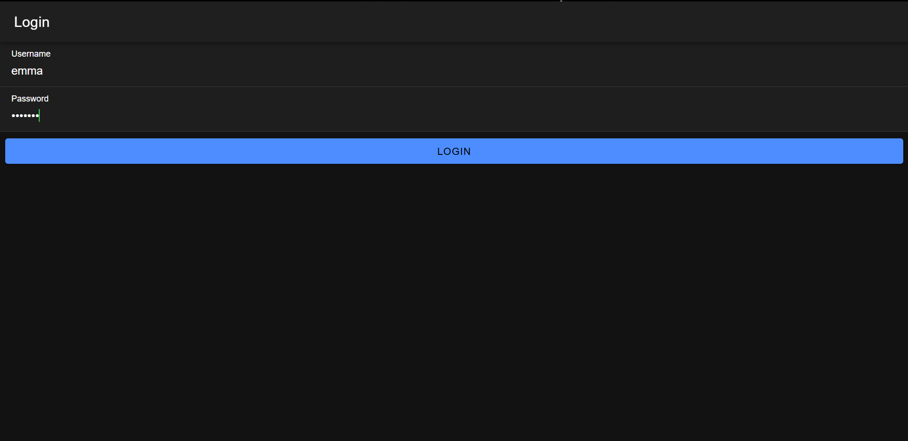
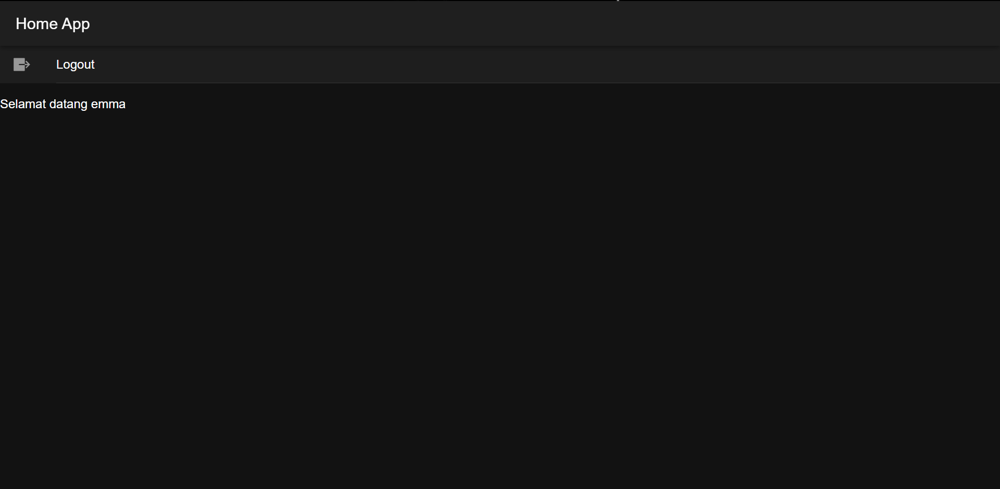

1. Penyediaan `HttpClient` untuk Interaksi API:
   - Di file `app.module.ts`, `provideHttpClient` didaftarkan untuk menyediakan kemampuan berinteraksi dengan API menggunakan HTTP client di dalam aplikasi.

2. Penyimpanan Data Autentikasi di `Preferences`:
   - Di dalam `authentication.service.ts`, variabel `TOKEN_KEY` dan `USER_KEY` digunakan sebagai kunci untuk menyimpan token autentikasi dan data pengguna ke dalam `Preferences` (local storage).
   - Saat login berhasil, token dan username disimpan dalam `Preferences` menggunakan `saveData`. Hal ini memungkinkan data pengguna untuk tetap tersedia meskipun aplikasi ditutup atau dimuat ulang.

3. Pengecekan Status Autentikasi:
   - `BehaviorSubject` bernama `isAuthenticated` didefinisikan untuk memantau status autentikasi pengguna. Status ini kemudian dijadikan acuan untuk mengarahkan pengguna ke halaman yang sesuai (misalnya, halaman login atau halaman utama).
   - Saat aplikasi dijalankan, metode `loadData` memuat token dan data pengguna dari `Preferences`. Jika data ditemukan, `isAuthenticated` diset ke `true`, menandakan bahwa pengguna sudah login.

4. Proses Login:
   - Di halaman `login.page.ts`, pengguna mengisi username dan password lalu menekan tombol "Login".
   - Fungsi `login()` pada `login.page.ts` memanggil `postMethod` di `authentication.service.ts`, yang mengirimkan data login ke API melalui HTTP POST.
   - Jika API merespon dengan status login "berhasil", fungsi `saveData` dipanggil untuk menyimpan token dan username. Selanjutnya, pengguna diarahkan ke halaman `/home`.
   - Jika login gagal, notifikasi ditampilkan menggunakan metode `notifikasi` untuk memberi tahu pengguna.

5. Penanganan Guard untuk Navigasi:
   - Dua guard disiapkan untuk melindungi rute: `authGuard` dan `autoLoginGuard`.
   - `authGuard` digunakan pada halaman `/home`, yang memastikan hanya pengguna yang sudah login (isAuthenticated: `true`) yang bisa mengaksesnya. Jika pengguna belum login, mereka akan diarahkan kembali ke halaman `/login`.
   - `autoLoginGuard` digunakan pada halaman `/login` untuk mencegah pengguna yang sudah login kembali ke halaman login. Jika pengguna sudah login, mereka langsung diarahkan ke halaman `/home`.

6. Logout:
   - Pada halaman `home.page.ts`, terdapat opsi "Logout" yang memanggil metode `logout` di `authentication.service.ts`.
   - Metode `logout` menghapus data token dan pengguna dari `Preferences`, mengubah `isAuthenticated` menjadi `false`, dan mengarahkan pengguna kembali ke halaman login.

7. Penggunaan API URL:
   - URL API diatur di `authentication.service.ts` dengan metode `apiURL`, sehingga semua panggilan API bisa diatur secara konsisten. Aplikasi saat ini diatur untuk menggunakan API dari `http://localhost/coba-login`.
